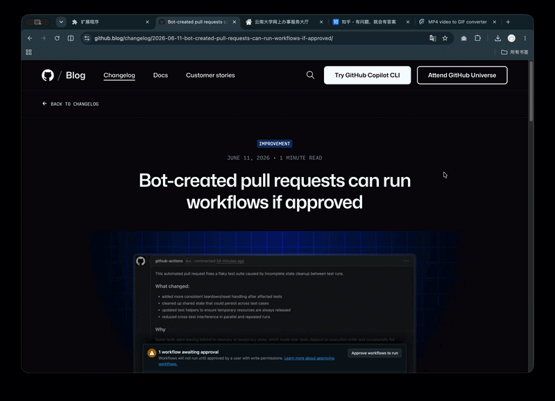
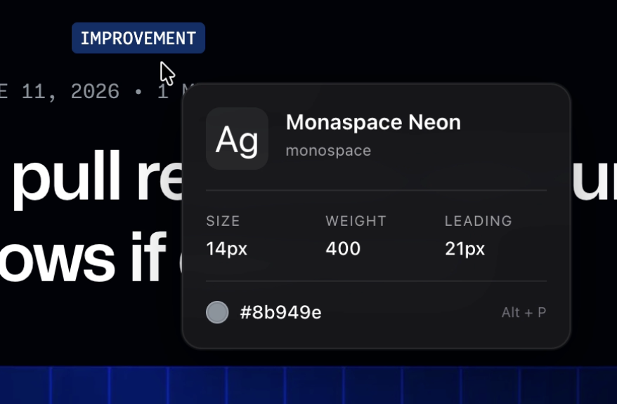

# TypePeek

一个轻量级 Chrome 浏览器插件，帮助设计师在浏览网页时**一键查看任意文字的字体信息**。

> 鼠标悬停，即可看到字体名、字号、字重、行高与颜色。

---

## 为什么做这个项目

作为视觉传达与用户体验设计背景的学生，我经常在做竞品分析时想知道某个网站用了什么字体、字号和行高。传统做法需要打开开发者工具一层层查看，很打断浏览节奏。

TypePeek 把这件事变得像 hover 取色一样简单——**鼠标划过文字，信息立刻呈现**。

---

## 功能

- 鼠标悬停任意网页文字，即时显示字体信息卡片
- 显示内容：字体名、字号（Size）、字重（Weight）、行高（Line Height）、颜色（Color）、字间距（Letter Spacing）
- 字体预览框使用 `Ag` 展示当前字体特征
- 智能卡片位置：根据屏幕边缘自动调整，避免被截断
- 支持 iframe 内文字检测
- `Option + P`（Mac）/ `Alt + P`（Windows）快速开关
- `ESC` 隐藏卡片

---

## 安装方式

1. 下载或克隆本项目到本地
2. 打开 Chrome，访问 `chrome://extensions/`
3. 右上角开启**开发者模式**
4. 点击**加载已解压的扩展程序**
5. 选择本项目文件夹 `typepeek/`

---

## 使用方式

- 安装后打开任意网页
- 将鼠标移动到任意文字上
- 等待约 100ms，信息卡片即会出现
- 按 `Option + P` 可暂停/恢复检测

---

## 技术亮点

- **Manifest V3**：使用最新 Chrome 扩展标准
- **Content Script 注入**：在任意网页上运行检测逻辑
- **Shadow DOM 隔离**：tooltip 样式完全独立于宿主网页，避免 CSS 污染
- **精确文本定位**：优先使用 `caretRangeFromPoint` / `caretPositionFromPoint` 获取鼠标下的具体文字节点
- **实际字体解析**：通过 `document.fonts.check()` 判断字体是否真正加载，避免被 fallback 字体误导
- **边界处理**：监听滚动、resize、DOM 变化，保证卡片位置正确且不会残留

---

## 项目结构

```
typepeek/
├── manifest.json      # 插件配置
├── content.js         # 核心检测与 tooltip 逻辑
├── README.md
└── assets/            # 截图与演示素材
```

---

## 进阶规划（B 版本）

A 版本解决的是“查看”问题，B 版本将升级为“研究工具”：

- 收藏感兴趣的字体记录
- 为每条记录添加研究备注
- 在弹出面板中管理所有收藏
- 导出成带注释的“排版研究卡片”图片，直接用于作品集或 case study

---

## 演示





---

## License

MIT
